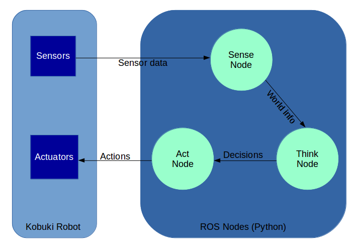

# kobukiROSindigo
> A kobuki robot ROS package (for both Gazebo and physical robot) that uses SWI-Prolog modules to take decisions.


The robot goes around, detects obstacles thanks to bumper sensors and shows what it sees from its point of view. \
Actually, Prolog integration code is commented because Pyswip library is not compatible with my environment, but you can try it  on your own. \
You can use SWI-Prolog programs to solve more complex tasks (you can see there a Pyswip example that you can expand).




It is made of 3 ROS nodes:
- SenseNode.py: Takes data from robot sensors.
- ThinkNode.py: Takes SenseNode.py results and uses bumper data to take a decision about velocity.
- ActNode.py: Takes ThinkNode.py results and gives commands to the robot motors.

## Instructions:
1. (OPTIONAL, do this if you are going to use SWI-Prolog and you don't have SWI-Prolog installed or if you have problems with Pyswip integration) Install SWI-Prolog with shared library enabled:
```sh
apt-get install autoconf
git clone https://github.com/SWI-Prolog/swipl-devel.git
cd swipl-devel
chmode u+x prepare
./prepare
chmod u+x configure
# To configure the source with shared library enabled:
./configure --prefix=/usr --enable-shared
make
sudo make install
cd packages/clpqr
./configure --prefix=/usr --enable-shared $ make && sudo make install
sudo ln -s /usr/lib/pl-5.6.34/lib/i686-linux/libpl.so.5.6.34 /usr/lib/libpl.so 
```
2. Install the Python needed library:
```sh
cd ../../..
git clone https://github.com/yuce/pyswip.git
cd pyswip
python setup.py install
```
3. If you don't have a  catkin workspace, create one:
```sh
cd ..
mkdir -p ~/catkin_ws/src
cd ~/catkin_ws/src
catkin_init_workspace
```
4. To crate and build the ROS robot package into the workspace:
```sh
cd ~/catkin_ws/src
catkin_create_pkg kobukiROSindigo std_msgs rospy roscpp
mkdir kobukiROSindigo/src
mkdir kobukiROSindigo/msg
cd ~/catkin_ws
catkin_make
echo "source devel/setup.bash" >> ~/.bashrc
```
5. To test it:
```sh
roscd kobukiROSindigo
cat package.xml
```
6. To import the code into the ROS package and build all its dependencies:
```sh
cd ~/catkin_ws
git clone https://github.com/agnsal/kobukiROSindigo.git
mv kobukiROSindigo/src/* src/kobukiROSindigo/src/
mv kobukiROSindigo/msg/* src/kobukiROSindigo/msg/
rm src/kobukiROSindigo/package.xml
rm src/kobukiROSindigo/CMakeLists.txt
mv kobukiROSindigo/package.xml src/kobukiROSindigo/
mv kobukiROSindigo/CMakeLists.txt src/kobukiROSindigo/
rm -r kobukiROSindigo
catkin_make  
```
7. To avoid errors with OpenCV library:
```sh
ln /dev/null /dev/raw1394
```
8. To build the robot scripts:
```sh
cd ~/catkin_ws/src/kobukiROSindigo/src
chmod +x senseNode.py
chmod +x thinkNode.py
chmod +x actNode.py 
```
9. To run the scripts (use a terminal window for each one) on the physical robot or on the simulation robot (that has to be launched in a separated terminal window using the command ``` roslaunch turtlebot_gazebo turtlebot_world.launch ```):
```sh
rosrun kobukiROSindigo senseNode.py
rosrun kobukiROSindigo thinkNode.py
rosrun kobukiROSindigo actNode.py
```


## Contacts

Agnese Salutari – agneses92@hotmail.it

Distributed under the Apache License 2.0. See ``LICENSE`` for more information.

[https://github.com/agnsal](https://github.com/agnsal)


## Contributing

1. Fork it (<https://github.com/yourname/yourproject/fork>)
2. Create your feature branch (`git checkout -b feature/fooBar`)
3. Commit your changes (`git commit -am 'Add some fooBar'`)
4. Push to the branch (`git push origin feature/fooBar`)
5. Create a new Pull Request
